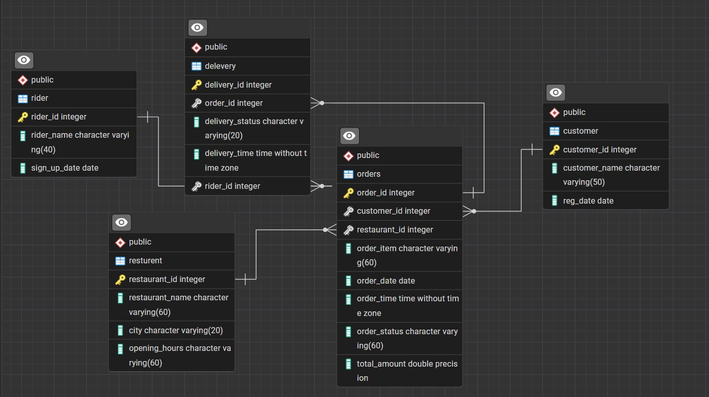

<p align="center">
  
</p>

# Zomato Sales Data Analytics - Complete Solution

## 📌 Table of Contents
- Project Overview
- Database Schema
- Complete Task Solutions
- Customer Analysis
- Restaurant Performance
- Delivery Operations
- Business Intelligence
- Implementation Guide
- Author & Contact

## 📊 Project Overview

This comprehensive analysis of Zomato's food delivery data provides actionable insights across 20 key business questions. The project covers:

- **Customer behavior** patterns and segmentation
- **Restaurant performance** metrics by city
- **Delivery efficiency** and rider performance
- **Sales trends** and seasonal analysis

**Database**: PostgreSQL  
**Level**: Advanced Analytics  
**Key Skills**: SQL, Data Modeling, Business Intelligence

## 🏗️ Database Schema
<p align="center">
  
</p>
### Entity-Relationship Diagram


### Table Details
1. **customer** - 100+ records
   - `customer_id` (PK), `customer_name`, `reg_date`

2. **restaurant** - 100+ records
   - `restaurant_id` (PK), `restaurant_name`, `city`, `opening_hours`

3. **orders** - 500+ records
   - `order_id` (PK), foreign keys, `order_item`, `order_date`, `total_amount`

4. **rider** - 150+ records
   - `rider_id` (PK), `rider_name`, `sign_up_date`

5. **delivery** - 500+ records
   - `delivery_id` (PK), foreign keys, `delivery_status`, `delivery_time`


## 🔍 Complete Task Solutions

### Customer Analysis

#### 1. Top Ordered Dishes by Specific Customer
```sql
WITH customer_orders AS (
    SELECT 
        o.order_item,
        COUNT(*) AS order_count,
        DENSE_RANK() OVER(ORDER BY COUNT(*) DESC) AS rank
    FROM orders o
    JOIN customer c ON o.customer_id = c.customer_id
    WHERE c.customer_name = 'Rahul Verma'
    AND o.order_date >= CURRENT_DATE - INTERVAL '2 years'
    GROUP BY o.order_item
)
SELECT order_item, order_count
FROM customer_orders
WHERE rank <= 2;
```

### 1. Write a query to find the top 2 most frequently ordered dishes by customer called "Rahul Varma" in the last 2 year.
```sql
---Answer to the question no 1


SELECT 
	customer,
	item,
	total_orders
FROM(
	SELECT
		 cs.customer_id AS id,
		cs.customer_name AS customer,
		ord.order_item AS item,
		COUNT(*) AS  total_orders,
		DENSE_RANK() OVER(ORDER BY COUNT(*) DESC) AS Rank
	FROM customer AS cs
	JOIN orders AS ord
	ON cs.customer_id=ord.customer_id
	WHERE ord.order_date >= CURRENT_DATE-  INTERVAL '2 Year'
		AND 
		cs.customer_name = 'Rahul Verma'
	
	GROUP BY 1,2,3
	ORDER BY 1,4 DESC) AS t1
WHERE RANK >=2;
```


### 2. Popular Time Slots , Question: Identify the time slots during which the most orders are placed. based on 2-hour intervals.
```sql
-- Answer to the question no 2
SELECT
	FLOOR(EXTRACT ( HOUR FROM order_time/2)*2) AS Starts_time, 
	FLOOR(EXTRACT (HOUR FROM order_time/2)*2)+2 AS End_time,
	COUNT(*) AS total_orders
FROM orders
GROUP BY 1,2
ORDER BY 3 DESC;
```
### 3. Order Value Analysis
```sql
--Question: Find the average order value per customer who has placed more than 20 orders. Return customer_name, and aov (average order value)

SELECT *
FROM orders;

SELECT *
FROM customer;

SELECT 
	DISTINCT ct.customer_name,
	AVG(total_amount) AS Avarage_order_value
FROM customer AS ct
JOIN orders AS ord
ON ct.customer_id = ord.customer_id
GROUP BY 1
HAVING COUNT(order_id)>=10
ORDER BY 2 DESC;
```
### 4. High-Value Customers
```sql
-- Question: List the customers who have spent more than 100K in total on food orders.
-- return customer_name, and customer_id

SELECT 
	cst.customer_name,
	SUM(ord.total_amount) AS Total_amount
FROM customer AS cst
JOIN orders AS ord
ON cst.customer_id = ord.customer_id
GROUP BY 1
HAVING SUM(total_amount)>=2500
ORDER BY 2 DESC;
```
### 5. Orders Without Delivery
```sql
-- Question: Write a query to find orders that were placed but not delivered.
-- Return each restuarant name, city and number of not delivered orders

-- Answer to the question no  5

SELECT*
FROM orders;

SELECT *
FROM restaurant;

SELECT *
FROM delivery

SELECT
	res.restaurant_name,
	res.city,
	COUNT(*) AS not_deleverd
	
FROM restaurant AS res
JOIN orders AS ord
ON res.restaurant_id = ord.restaurant_id
JOIN delivery AS del
ON ord.order_id = del.order_id
WHERE
	delivery_status='Not Delivered'
GROUP BY 1,2
ORDER BY 3 DESC;
```
### Q. 6 Restaurant Revenue Ranking
```sql
-- Rank restaurants by their enutotal reve from the last year, including their name,
-- total revenue, and rank within their city.  

SELECT *
FROM restaurant;

SELECT *
FROM orders;

WITH cte_table
AS(
SELECT
	res.restaurant_name,
	res.city,
	SUM(ord.total_amount) AS Total_revenue,
	DENSE_RANK() OVER(PARTITION BY res.city ORDER BY SUM(ord.total_amount) DESC) AS Rank
FROM restaurant AS res
JOIN orders AS ord
ON res.restaurant_id = ord.restaurant_id
WHERE ord.order_date>= CURRENT_DATE - INTERVAL '2 Year'
GROUP BY 1,2)
SELECT *
FROM cte_table
WHERE Rank =1;
```
### Q. 7
```sql
-- Most Popular Dish by City:
-- Identify the most popular dish in each city based on the number of orders.

SELECT *
FROM restaurant;

SELECT *
FROM orders;

WITH dish_ranking
AS(
SELECT
	res.city AS City,
	ord.order_item As Dishes,
	COUNT(ord.order_id) Total_orders,
	DENSE_RANK() OVER(PARTITION BY res.city ORDER BY COUNT(ord.order_id) DESC) AS Rank
FROM restaurant AS res
JOIN orders AS ord
ON ord.restaurant_id = res.restaurant_id
GROUP BY 1,2
 )	
SELECT
	City,
	Dishes
FROM dish_ranking
WHERE Rank=1
ORDER BY Total_orders DESC;
```
### Q.8 Customer Churn:
```sql
-- Find customers who haven't placed an order in 2024 but did in 2023.

-- Answer to the question no 8

SELECT *
FROM customer;

SELECT *
FROM orders;

SELECT
	DISTINCT ord.customer_id,
	cus.customer_name,
	EXTRACT(YEAR FROM order_date) AS Year
FROM customer AS cus
JOIN orders AS ord
ON ord.customer_id = cus.customer_id 
WHERE 
	EXTRACT(YEAR FROM order_date)=2023
	AND
	ord.customer_id NOT IN (SELECT DISTINCT customer_id
							FROM orders WHERE EXTRACT(YEAR FROM order_date)=2024)
GROUP BY 1,2,3
ORDER BY 3;
```
### Q.9 Cancellation Rate Compoarison
```sql
-- calculate and compare the order cancellaton rate for each restaurant between the 
-- current year and the previous year.

----------------Answer to the question no 09
WITH 
count_cancelation_23
AS(
SELECT
	ord.restaurant_id AS Restaurant,
	COUNT(ord.order_id) Total_orders,
	COUNT(CASE
				WHEN	
					dev.delivery_id IS NULL
				THEN 1
		  END) AS Total_cancelation
FROM orders AS ord
LEFT JOIN delivery AS dev
ON ord.order_id = dev.order_id
JOIN restaurant AS res
ON ord.restaurant_id = res.restaurant_id
WHERE 
	EXTRACT(YEAR FROM ord.order_date)=2023
GROUP BY 1)
,
count_cancelation_24
AS
(SELECT
	ord.restaurant_id AS Restaurant,
	COUNT(ord.order_id) Total_orders,
	COUNT(CASE
				WHEN	
					dev.delivery_id IS NULL
				THEN 1
		  END) AS Total_cancelation
FROM orders AS ord
LEFT JOIN delivery AS dev
ON ord.order_id = dev.order_id
JOIN restaurant AS res
ON ord.restaurant_id = res.restaurant_id
WHERE 
	EXTRACT(YEAR FROM ord.order_date)=2024
GROUP BY 1)
,
last_data
AS(
SELECT 
	Restaurant,
	Total_orders,
	Total_cancelation,
	ROUND(Total_cancelation::numeric/Total_orders::numeric*100, 2) AS Total_cancel_parcentage
FROM count_cancelation_23),
present_data
AS(
SELECT 
	Restaurant,
	Total_orders,
	Total_cancelation,
	ROUND(Total_cancelation::numeric/Total_orders::numeric*100, 2) AS Total_cancel_parcentage
FROM count_cancelation_24)

SELECT
	data1.Restaurant AS Restaurant_id,
	data1.Total_cancel_parcentage AS Total_cancelation_2023,
	data2.Total_cancel_parcentage AS present_Total_cancelation_2024
FROM last_data AS data1
JOIN present_data AS data2
ON data1.Restaurant=data2.Restaurant;
```
### Q.10 Rider Average Delivery Time
```sql
-- Determine each rider's average delivery time. 

Answer to the question no 10
SELECT
	ord.order_id,
	del.rider_id,
	ord.order_time,
	del.delivery_time,
	ROUND(EXTRACT(EPOCH FROM del.delivery_time-ord.order_time+
						CASE 
							WHEN del.delivery_time<ord.order_time
								THEN INTERVAL '1 Day'
							ELSE '0 Day'
						END)/60,2) AS the_secent
FROM orders AS ord
JOIN delivery AS del
ON ord.order_id=del.order_id;
```
### Q.11 Monthly Restaurant Growth Ratio
```sql
-- Calculate each restaurant's growth ratio base d on the total number of delivered orders since its joining

WITH order_ratio
AS(
SELECT 
	ord.restaurant_id AS resturant,
	TO_CHAR(ord.order_date, 'mm-yy') AS months,
	COUNT(ord.order_id)AS last_month_order,
	LAG(COUNT(ord.order_id),1) OVER(PARTITION BY ord.restaurant_id ORDER BY TO_CHAR(ord.order_date, 'mm-yy')) As previous_month_order
FROM orders AS ord
JOIN delivery AS del
ON ord.order_id = del.order_id
WHERE del.delivery_status='Delivered'
GROUP BY 1,2)

SELECT*,
	ROUND((last_month_order::numeric-previous_month_order::numeric)/previous_month_order::numeric*100,2) AS monthly_growth_ratio
FROM order_ratio
```
### Q.12 Customer Segmentation
```sql
-- Customer Segmentation: Segment customers into 'Gold' or 'Silver' groups based on their total spending compared to the average order value (AOV). 
-- If a customer's total spending exceeds the AOV, label them as 'Gold'; otherwise, label them as 'Silver'. Write an SQL query to determine each segment's total number of orders and total revenue

-- Answer to the question no 12 ---

-- Answer with every customer and the segment ---- 

SELECT
	DISTINCT(cus.customer_id),
	cus.customer_name,
	CASE
		WHEN ord.total_amount>(
SELECT
	AVG(total_amount)
FROM orders)
		THEN 'Gold'
		ELSE 'Silver'
	END
FROM customer AS cus
JOIN orders AS ord
ON cus.customer_id = ord.customer_id
GROUP BY 1,2,3
ORDER BY 3 DESC;

-- Answer as total aggregate as total count of order and total revenue

SELECT
	t1.ranks AS category,
	SUM(t1.total_orders) AS total_orders,
	SUM(t1.total_spent) AS total_revenue
FROM	
(
SELECT
	customer_id,
	SUM(total_amount) AS total_spent,
	COUNT(order_id) AS total_orders,
	CASE
		WHEN total_amount>(
		SELECT
			AVG(total_amount)
		FROM orders)
			THEN 'Gold'
		ELSE 'Silver'
		END AS ranks	
FROM orders
GROUP BY 1,4) AS t1
GROUP BY 1;
```
### Q.13 Rider Monthly Earnings
```sql
-- Calculate each rider's total monthly earnings, assuming they earn 8% of the order amount.

SELECT
	dev.rider_id,
	TO_CHAR(ord.order_date, 'mm-yyyy') AS month,
	SUM(ord.total_amount) AS monthly_total_income,
	SUM(ord.total_amount)*8/100 AS rider_income
FROM delivery AS dev
JOIN orders AS ord
ON dev.order_id=ord.order_id
GROUP BY 1,2
ORDER BY 1,2;
```
### Q.14 Rider Ratings Analysis
```sql
---Find the number of 5-star, 4-star, and 3-star ratings each rider has.
--- riders receive this rating based on delivery time.
--- If orders are delivered less than 15 minutes of order received time the rider get 5 star rating,
--- if they deliver 15 and 20 minute they get 4 star rating
--- if they deliver after 20 minute they get 3 star rating.

-- Answer to the question no 13

-- for every order ranking

WITH calculatig_order_time
AS(
SELECT
	dev.rider_id AS rider,
	ord.order_id AS orders,
	ROUND(EXTRACT(EPOCH FROM  dev.delivery_time-ord.order_time+
					CASE
						WHEN ord.order_time>dev.delivery_time
							THEN INTERVAL '1 Day'
						ELSE INTERVAL '0 Day'
					END)/60) AS order_complete_time				
						
FROM orders AS ord
JOIN delivery AS dev
ON dev.order_id = ord.order_id
WHERE dev.delivery_status='Delivered'
ORDER BY 1)

SELECT
	rider,
	orders,
		(CASE
		WHEN order_complete_time=30
			THEN '5 STAR'
		WHEN order_complete_time BETWEEN 31 AND 60
			THEN '4 STAR'
		ELSE '3 STAR'
	END)	
FROM calculatig_order_time
;

-- Total ranking of a rider
WITH total_rider_rank
AS(

	WITH calculatig_order_time
	AS(
	SELECT
		dev.rider_id AS rider,
		ord.order_id AS orders,
		ROUND(EXTRACT(EPOCH FROM  dev.delivery_time-ord.order_time+
						CASE
							WHEN ord.order_time>dev.delivery_time
								THEN INTERVAL '1 Day'
							ELSE INTERVAL '0 Day'
						END)/60) AS order_complete_time				
							
	FROM orders AS ord
	JOIN delivery AS dev
	ON dev.order_id = ord.order_id
	WHERE dev.delivery_status='Delivered'
	ORDER BY 1)
	
	SELECT
		rider,
		order_complete_time,
			(CASE
			WHEN order_complete_time BETWEEN 1 AND 30
				THEN '5 STAR'
			WHEN order_complete_time BETWEEN 31 AND 60
				THEN '4 STAR'
			ELSE '3 STAR'
		END) as rider_rank	
	FROM calculatig_order_time)
SELECT
	rider,
	rider_rank,
	COUNT(*)
FROM total_rider_rank	
GROUP BY 1,2
ORDER BY 1

```
### Q.15 Order Frequency by Day
```sql
-- Analyze order frequency per day of the week and identify the peak day for each restaurant.

-- Answer to the question no 15


WITH week_order_ranking
AS(
SELECT
	res.restaurant_name AS restaurant,
	TO_CHAR(ord.order_date, 'Day') AS days,
	COUNT(ord.order_id) AS total_orders,
	DENSE_RANK() OVER(PARTITION BY res.restaurant_name ORDER BY COUNT(ord.order_id) DESC )  AS ranks
FROM restaurant AS res
JOIN orders AS ord
ON res.restaurant_id = ord.restaurant_id
GROUP BY 1,2
ORDER BY 1)
SELECT
	restaurant,
	days AS peak_day,
	total_orders
FROM week_order_ranking
WHERE ranks=1
ORDER BY 3 DESC;
```

### Q.16 Customer Lifetime Value (CLV)
```sql
-- Calculate the total revenue generated by each customer over all their orders.

-- Answer to the question no 16


SELECT
	cus.customer_name,
	COUNT(ord.order_id) AS total_orders,
	SUM(ord.total_amount) AS clv
FROM orders AS ord
JOIN customer AS cus
ON ord.customer_id = cus.customer_id
GROUP BY 1
ORDER BY 2 DESC;
```
### Q.17.1 Monthl orders Trends
```sql
-- Identify sales trends by comparing each month's total orders to the previous year.
-----------------
WITH
total_month_counting
AS
(
SELECT 
	EXTRACT (MONTH FROM order_date) AS months_order,
	TO_CHAR(order_date, 'Month') AS months_name
FROM orders),
couting_order_current
AS(

SELECT 
      EXTRACT(MONTH FROM order_date) AS         
        months,
      COUNT(order_id) AS total_order
FROM orders
WHERE EXTRACT(YEAR FROM order_date)=2023
GROUP BY 1),
couting_order_previous
AS(
SELECT 
      EXTRACT(MONTH FROM order_date) AS         
        months,
      COUNT(order_id) AS total_order
FROM orders
WHERE EXTRACT(YEAR FROM order_date)=2024
GROUP BY 1)

SELECT
      month_info.months_order AS month_rank,
	  month_info.months_name,
      current.total_order AS current_month_total_order,
      previous.total_order AS previous_month_total_order
	  
FROM total_month_counting AS month_info
FULL JOIN couting_order_current AS current 
ON month_info.months_order=current.months
FULL JOIN couting_order_previous AS previous
ON month_info.months_order=previous.months
GROUP BY 1,2,3,4
ORDER BY 1,2;
```

### Q.17.2 Monthly Sales Trends
```sql
-- Identify sales trends by comparing each month's total sales to the previous month.
WITH month_sales
AS(
SELECT 
	EXTRACT (YEAR FROM order_date) AS year,
	EXTRACT (MONTH FROM order_date) AS month,
	SUM(total_amount) AS current_order,
	LAG(SUM(total_amount),1) OVER( PARTITION BY EXTRACT (YEAR FROM order_date) ORDER BY EXTRACT (MONTH FROM order_date)) AS previous_order
FROM orders
GROUP BY 1,2
ORDER BY 1,2)

SELECT
	year,
	month,
	current_order AS total_sales,
	(current_order-previous_order) monthly_sale_growth
FROM month_sales
```
### Q.18 Rider Efficiency
```sql
-- Evaluate rider efficiency by determining average delivery times and identifying those with the lowest and highest averages.
WITH counting_delivery_time
AS (
SELECT
	dev.rider_id AS riders,
	ord.order_time,
	dev.delivery_time,
	ROUND(EXTRACT(EPOCH FROM (dev.delivery_time-ord.order_time+
						CASE
							WHEN ord.order_time>dev.delivery_time 
								THEN INTERVAL '1 Day'
							ELSE INTERVAL '0 Day'
						END))/60,2) AS delivery_time_spent_in_miniute-----calculate_every_rider_how_many_time_spent_to_delivery
FROM orders as ord
JOIN delivery as dev
ON dev.order_id = ord.order_id
WHERE dev.delivery_status='Delivered'),
average_delivery_time_counting
AS(
SELECT
	riders,
	AVG(delivery_time_spent_in_miniute) AS average_delivery_time----a_rider has multiple delivery so it has multiple delivery time, so with this function we get a result of average delivery time of a rider.
FROM counting_delivery_time
GROUP BY 1)

SELECT
	MIN(average_delivery_time),
	MAX(average_delivery_time)
FROM average_delivery_time_counting
```
### Q.19 Order Item Popularity
```sql
-- Track the popularity of specific order items over time and identify seasonal demand spikes.


SELECT
	order_item,
	season,
	COUNT(order_id)
FROM 
(SELECT
	*,
	EXTRACT(MONTH FROM order_date)AS month,
	(CASE
		WHEN EXTRACT(MONTH FROM order_date)<4
			THEN 'Spring'
		WHEN EXTRACT(MONTH FROM order_date) BETWEEN 4 AND 8
			THEN 'Summer'
		ELSE 'Winter'
	END) AS season
FROM orders) AS table_season_making
GROUP BY 1,2
ORDER BY 3 DESC
```
### Q.20 Rank each city based on the total revenue for last year 2023
```sql

SELECT
	res.city,
	COUNT(ord.total_amount)
FROM orders AS ord
JOIN restaurant AS res
ON ord.restaurant_id = res.restaurant_id
WHERE (EXTRACT(YEAR FROM ord.order_date))=2023
GROUP BY 1
ORDER BY 2 DESC
```
## 🧪 How to Use This Project

1. **Clone the Repo**

   ```bash
   git clone https://github.com/dhananjoy01/zomato_analysis.git
   ```

2. **Import the SQL File** Load `zomato_analysis.sql` into your PostgreSQL or compatible database.

3. **Run the Queries** Use any SQL IDE (pgAdmin, DBeaver, MySQL Workbench, etc.) to execute and explore.

4. **Customize Further** Enhance the project by adding joins, window functions, or visual dashboards.

## 👨‍💻 Author & Contact

**Dhanan Joy Chandro Roy**  
Data Analyst | SQL Specialist | Business Intelligence Developer  

📌 Professional Profiles:
- [LinkedIn](https://www.linkedin.com/in/dhananjoy01)
- [Data Science Portfolio](https://www.datascienceportfol.io/dhananjoychandro01)
- [GitHub](https://github.com/dhananjoy01)

✉️ Contact: dhananjoychandro01@gmail.com

---

> "Data is the new oil, and analytics is the combustion engine." - This project transforms raw delivery data into actionable business intelligence for Zomato's operations.
